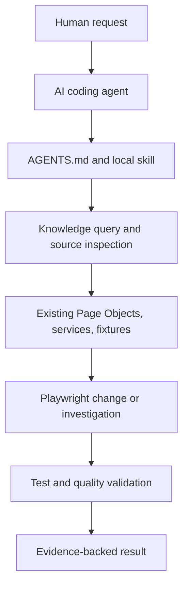

# Playwright Agentic Automation

> A Playwright + TypeScript agentic automation framework with a repository-local LLM Wiki/codebase second brain for AI-assisted test maintenance.

[](https://github.com/Mallikarjun-Roddannavar/playwright-agentic-automation/actions/workflows/ci.yml)
[](https://playwright.dev/)
[](https://www.typescriptlang.org/)

Playwright Agentic Automation combines a runnable practice application, a maintainable Playwright framework, repository-local agent skills, and an evidence-backed LLM Wiki/codebase second brain. The knowledge layer helps external AI coding agents understand the framework, connect product behavior to tests, and maintain UI/API automation with repository evidence.

## Core idea: a local LLM Wiki and codebase second brain

This repository explores how a Playwright codebase can provide durable context to AI coding agents without depending on a hosted knowledge platform. Its main building blocks are:

- **Local LLM Wiki / second brain** — linked Markdown notes in `knowledge/` for architecture, decisions, runbooks, product behavior, testing knowledge, and source relationships.
- **Open Knowledge Format (OKF)** — a portable structure for sharing knowledge and provenance, inspired by [Google Cloud's Open Knowledge Format overview](https://cloud.google.com/blog/products/data-analytics/how-the-open-knowledge-format-can-improve-data-sharing).
- **Repository instructions** — `AGENTS.md` defines how an agent should navigate and change this Playwright framework, following the [AGENTS.md convention](https://agents.md/).
- **Agent Skills** — `.agents/skills/` provides reusable, task-specific instructions following the [Agent Skills standard](https://agentskills.io/home).

The approach is also informed by [Andrej Karpathy's LLM Wiki concept](https://gist.github.com/karpathy/442a6bf555914893e9891c11519de94f): keep useful context organized, retrievable, and close to the work. Here, that idea is applied specifically to Playwright UI/API automation, Page Objects, fixtures, services, tests, and evidence-backed maintenance.

## Why this project?

Most Playwright repositories show how tests run. This project also shows how an AI coding agent can navigate and maintain those tests using a repository-local second brain and explicit guidance:

- `AGENTS.md` defines ownership and framework rules.
- `.agents/skills/` provides reusable workflows for UI, API, tooling, and incident work.
- `knowledge/` acts as an LLM Wiki: it stores durable Markdown notes, deterministic code relationships, and grounded product/testing knowledge.
- Playwright tests, Page Objects, API services, fixtures, and validation commands provide the executable evidence.

The repository does not contain an autonomous AI service. An external coding agent such as Codex can use these instructions, skills, and knowledge artifacts while working in the repository.

## Try it in three minutes

```bash
git clone https://github.com/Mallikarjun-Roddannavar/playwright-agentic-automation.git
cd playwright-agentic-automation
npm install
npm run install:browsers
npm run test:list
npm test
```

The test command starts the local FastAPI backend and Vite frontend, runs the UI/API suite, and stops the services afterward. See [Getting Started](docs/GETTING_STARTED.md) for Python and frontend prerequisites.

## LLM Wiki / Codebase Second Brain

The `knowledge/` directory is a repository-local, offline-first second brain for this Playwright codebase. It is inspired by the LLM Wiki and second-brain approach: store useful context in durable, linked notes so an AI agent can retrieve the smallest relevant context instead of rediscovering the repository from scratch.

- Markdown knowledge records architecture, decisions, runbooks, product behavior, and testing behavior.
- The deterministic static graph captures code relationships such as imports, Page Object navigation, API services, routes, fixtures, and package usage.
- Product and testing knowledge connects expected behavior to specs, Page Objects, tests, and assertions.
- Agents can query the saved knowledge, verify important claims against source and test evidence, and detect stale or conflicted knowledge after changes.
- The bundle follows OKF, remains usable in Markdown or Obsidian, and does not require a hosted search service, vector database, or LLM runtime.

The repository also includes a Codex-assisted testing second brain that inventories Playwright tests, creates evidence-backed knowledge proposals, detects stale or conflicting claims, and keeps an auditable workflow history.

## Agent workflow



This describes a supported repository workflow. The external coding agent still performs the reasoning, editing, and command execution.

## Repository focus

The knowledge and agent layers sit on top of a real Playwright framework:

- UI tests use TypeScript Page Objects and API tests use reusable services.
- Shared fixtures provide authenticated admin, editor, and viewer sessions.
- `AGENTS.md` and `.agents/skills/` define framework-aware agent workflows.
- `knowledge/` records the relationships and evidence an agent needs to work safely.

## Quickstart

Install dependencies and browsers:

```bash
npm install
cd app/backend && python -m venv .venv && pip install -r requirements.txt
cd ../frontend && npm install
cd ../.. && npm run install:browsers
```

Run the application-backed Playwright suite:

```bash
npm run test:list
npm test
```

The Playwright configuration starts the FastAPI backend and Vite frontend automatically. See [Getting Started](docs/GETTING_STARTED.md) for platform-specific setup and troubleshooting.

## Framework Highlights

- Playwright UI and API projects with TypeScript Page Objects and reusable API services.
- Role-based browser/API fixtures with authentication and cleanup.
- Centralized route and configuration ownership for predictable agent changes.
- Local skills and knowledge queries that help agents navigate and maintain the framework.
- Linting, typechecking, naming checks, reporting, and freshness validation for evidence-backed changes.

## Persistent Codebase Knowledge

`knowledge/` is a committed, offline-first second brain that follows [Google Cloud Open Knowledge Format v0.2](https://github.com/GoogleCloudPlatform/knowledge-catalog/blob/main/okf/SPEC.md). Its Markdown concepts are the portable, model-neutral knowledge layer; the generated JSON graph and Mermaid diagrams are deterministic, AST-derived views.

The graph intentionally represents static code relationships—not runtime calls, execution traces, coverage, or a security model. It extracts imports, exports, inheritance, page-object navigation, API-service and route usage, fixtures, and package usage. Generated concepts include source hashes, provenance, and machine verification so agents can check freshness before trusting a fact.

```bash
# Generate or refresh saved AST facts, OKF concepts, Mermaid diagrams, and graph JSON
npm run knowledge:build

# Validate OKF structure, provenance/trust fields, and graph referential integrity
npm run knowledge:validate

# Fail when committed generated knowledge is stale, then validate it
npm run knowledge:check

# Query saved knowledge without reparsing the repository
npm run knowledge:query -- LoginPage
npm run knowledge:query -- --relation NAVIGATES_TO
npm run knowledge:query -- --relation USES_API_ROUTE

# Build and trace testing knowledge
npm run knowledge:inventory
npm run knowledge:propose
npm run knowledge:verify-all
npm run knowledge:trace -- verification

# Run the complete static quality gate, including knowledge freshness
npm run quality:check
```

If npm itself encounters the known Windows `EPERM`/realpath issue, run `node ./scripts/buildKnowledge.mjs --check` followed by `node ./scripts/validateKnowledge.mjs` directly.

Open `knowledge/` directly as an [Obsidian](https://obsidian.md/) vault for native Markdown links, backlinks, Graph view, frontmatter properties, and Mermaid rendering. No Obsidian account, plugin, cloud service, Gemini key, vendor SDK, embedding model, or vector database is required. Keep human-authored material in `architecture/`, `decisions/`, and `runbooks/`; `generated/` is owned by the deterministic extractor.

## Guidance

For detailed framework rules, naming conventions, ownership boundaries, config guidance, and validation defaults, see:

- `AGENTS.md`
- `.agents/skills/`

For focused walkthroughs, see:

- [Knowledge layer](docs/KNOWLEDGE_LAYER.md)
- [Agentic Playwright workflow](docs/AGENTIC_WORKFLOW.md)
- [Examples](examples/README.md)
- [Agent skills index](.agents/skills/README.md)
- [Roadmap](ROADMAP.md)
- [Contributing](CONTRIBUTING.md)
- [Getting started](docs/GETTING_STARTED.md)
- [Final improvement audit](docs/FINAL_AUDIT.md)
- [Repository audit](docs/REPOSITORY_AUDIT.md)
