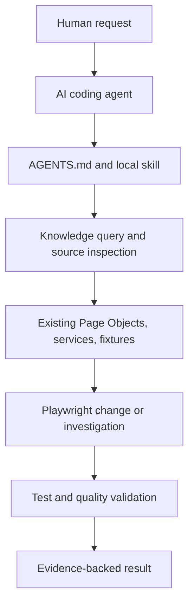

# Playwright Agentic Automation

> An agent-ready Playwright + TypeScript framework for building, understanding, debugging, and maintaining UI/API tests with AI coding agents.

[](https://github.com/Mallikarjun-Roddannavar/playwright-agentic-automation/actions/workflows/ci.yml)
[](https://playwright.dev/)
[](https://www.typescriptlang.org/)

Playwright Agentic Automation is a hands-on reference project that combines a runnable practice application, a maintainable Playwright framework, repository-local agent skills, and an evidence-backed codebase knowledge layer.

## Why this project?

Most Playwright repositories show how tests run. This project also shows how an AI coding agent can navigate and maintain those tests using explicit repository guidance:

- `AGENTS.md` defines ownership and framework rules.
- `.agents/skills/` provides reusable workflows for UI, API, tooling, and incident work.
- `knowledge/` stores deterministic code relationships plus grounded product/testing knowledge.
- Playwright tests, Page Objects, API services, fixtures, and validation commands provide the executable evidence.

The repository does not contain an autonomous AI service. An external coding agent such as Codex can use these instructions, skills, and knowledge artifacts while working in the repository.

## Try it in three minutes

```bash
git clone https://github.com/Mallikarjun-Roddannavar/playwright-agentic-automation.git
cd playwright-agentic-automation
npm install
npm run install:browsers
npm run test:list
npm test
```

The test command starts the local FastAPI backend and Vite frontend, runs the UI/API suite, and stops the services afterward. See the setup section below for the Python and frontend prerequisites.

## Agent workflow



This describes a supported repository workflow. The external coding agent still performs the reasoning, editing, and command execution.

## What This Repo Contains

This repository is a full-stack Playwright learning lab: it contains the practice application, the automation framework, and the agent skills used to understand and maintain both.

It provides:

- UI automation using Page Object Model
- API automation using service classes
- shared multi-role fixtures for browser and API sessions
- linting, formatting, typechecking, reporting, and naming checks
- local `AGENTS.md` and `.agents/skills/` guidance for framework-aligned changes

## At a glance

| Area                | What is included                                                                                 |
| ------------------- | ------------------------------------------------------------------------------------------------ |
| UI testing          | TypeScript Page Objects and role-aware Playwright specs                                          |
| API testing         | Assertion-free API services and API specs                                                        |
| Test infrastructure | Shared browser/API fixtures, auth setup, cleanup, logging, and reporting                         |
| Agent guidance      | `AGENTS.md` plus repository-local skills                                                         |
| Codebase knowledge  | OKF Markdown, static graph, Mermaid views, freshness checks, and Login product/testing knowledge |

## Repository Layout

The practice application and automation framework live in this single learning repository:

```text
playwright-agentic-automation/
  .agents/skills/
  app/
    backend/
    frontend/
    manual_test_cases/
  api/
  ui/
  utils/
  knowledge/
  playwright.config.ts
```

## Prerequisites

Install the application and automation dependencies once:

```bash
# Application backend
cd app/backend
python -m venv .venv
# Windows PowerShell: .venv\Scripts\Activate.ps1
# macOS/Linux: source .venv/bin/activate
pip install -r requirements.txt

# Application frontend
cd ../frontend
npm install

# Automation framework
cd ../..
npm install
npm run install:browsers
```

## Structure

```text
playwright-agentic-automation/
  .agents/
    skills/
  api/
    services/
    specs/
  config/
    test-config.json
  scripts/
  ui/
    pages/
    setup/
    specs/
    test-data/
  utils/
    common/
    fixtures/
  playwright.config.ts
  package.json
  README.md
  AGENTS.md
```

## Setup

```bash
cd playwright-agentic-automation
npm install
npm run install:browsers
```

## Run Locally

`npm test` automatically starts the FastAPI backend and Vite frontend, waits until both are ready, runs the tests, and stops the processes afterward. If either service is already running locally, Playwright reuses it.

```bash
npm run test:list
npm test
npm run test:ui
npm run test:api
npm run test:debug
npm run report
npm run lint
npm run lint:fix
npm run typecheck
npm run check:naming
npm run format
npm run format:check
```

### Manual Server Startup (Windows PowerShell)

If the VS Code Playwright extension does not start the configured web servers automatically, start them manually in two terminals.

Terminal 1 (backend):

```powershell
cd C:\AUTO_WS\GH_PERS\playwright-agentic-automation\app\backend
.\.venv\Scripts\python.exe -m uvicorn main:app --host 127.0.0.1 --port 8001
```

Terminal 2 (frontend):

```powershell
cd C:\AUTO_WS\GH_PERS\playwright-agentic-automation\app\frontend
$env:VITE_API_BASE_URL = "http://127.0.0.1:8001"
npm run dev -- --host 127.0.0.1 --port 5174
```

Keep both terminals running, then run the tests from the Playwright VS Code extension.

The default application root is `app`. If you use a different application checkout, set an absolute or relative application root before running tests:

```powershell
# Windows PowerShell
$env:PLAYWRIGHT_APP_ROOT = "C:\src\playwright-practice-app"
npm test
```

```bash
# macOS/Linux
PLAYWRIGHT_APP_ROOT=/src/playwright-practice-app npm test
```

To run against services that are already hosted elsewhere, update `BASE_URLS` in `config/test-config.json` and disable local process startup:

```powershell
$env:PLAYWRIGHT_SKIP_WEBSERVER = "1"
npm test
```

```bash
PLAYWRIGHT_SKIP_WEBSERVER=1 npm test
```

The local server ports and frontend-to-backend URL are derived from `config/test-config.json`; do not duplicate them in scripts.

## Change Workflow

When you change test code:

```bash
npm test
```

When you change URLs or credentials in `config/test-config.json`, re-run the most relevant validation commands.

Typical validation after config changes:

```bash
npm run test:list
npm test
```

## Framework Highlights

- Playwright project dependencies for reusable authenticated setup
- role-based shared fixtures in `utils/fixtures/TestFixtures.ts`
- route constants centralized in page and service base classes
- TypeScript path aliases for framework-local imports
- custom framework logger and custom reporter summary
- cleanup registration through the shared `cleanup` fixture

## Quality Tools

- ESLint uses `eslint.config.mjs`
- Prettier uses `.prettierrc.json` and `.prettierignore`
- `npm run check:naming` enforces framework naming conventions
- `utils/common/Logger.ts` provides the framework logger
- `utils/common/CustomReporter.ts` writes `test-results/framework-summary.json`

## Persistent Codebase Knowledge

`knowledge/` is a committed, offline-first second brain that follows [Google Cloud Open Knowledge Format v0.2](https://github.com/GoogleCloudPlatform/knowledge-catalog/blob/main/okf/SPEC.md). Its Markdown concepts are the portable, model-neutral knowledge layer; the generated JSON graph and Mermaid diagrams are deterministic, AST-derived views.

The graph intentionally represents static code relationships—not runtime calls, execution traces, coverage, or a security model. It extracts imports, exports, inheritance, page-object navigation, API-service and route usage, fixtures, and package usage. Generated concepts include source hashes, provenance, and machine verification so agents can check freshness before trusting a fact.

```bash
# Generate or refresh saved AST facts, OKF concepts, Mermaid diagrams, and graph JSON
npm run knowledge:build

# Validate OKF structure, provenance/trust fields, and graph referential integrity
npm run knowledge:validate

# Fail when committed generated knowledge is stale, then validate it
npm run knowledge:check

# Query saved knowledge without reparsing the repository
npm run knowledge:query -- LoginPage
npm run knowledge:query -- --relation NAVIGATES_TO
npm run knowledge:query -- --relation USES_API_ROUTE

# Run the complete static quality gate, including knowledge freshness
npm run quality:check
```

If npm itself encounters the known Windows `EPERM`/realpath issue, run `node ./scripts/buildKnowledge.mjs --check` followed by `node ./scripts/validateKnowledge.mjs` directly.

Open `knowledge/` directly as an [Obsidian](https://obsidian.md/) vault for native Markdown links, backlinks, Graph view, frontmatter properties, and Mermaid rendering. No Obsidian account, plugin, cloud service, Gemini key, vendor SDK, embedding model, or vector database is required. Keep human-authored material in `architecture/`, `decisions/`, and `runbooks/`; `generated/` is owned by the deterministic extractor.

## Sample Specs

- `ui/specs/login.spec.ts`
- `ui/specs/multi-role.spec.ts`
- `ui/specs/files.spec.ts`
- `api/specs/health.spec.ts`
- `api/specs/rbac.spec.ts`

## Guidance

For detailed framework rules, naming conventions, ownership boundaries, config guidance, and validation defaults, see:

- `AGENTS.md`
- `.agents/skills/`

For focused walkthroughs, see:

- [Knowledge layer](docs/KNOWLEDGE_LAYER.md)
- [Agentic Playwright workflow](docs/AGENTIC_WORKFLOW.md)
- [Examples](examples/README.md)
- [Agent skills index](.agents/skills/README.md)
- [Roadmap](ROADMAP.md)
- [Contributing](CONTRIBUTING.md)
- [Getting started](docs/GETTING_STARTED.md)
- [Final improvement audit](docs/FINAL_AUDIT.md)
- [Repository audit](docs/REPOSITORY_AUDIT.md)

## Using Hermes Agent

This repository natively supports [Hermes Agent](https://hermes-agent.nousresearch.com/) since it utilizes the vendor-neutral `agentskills.io` standard. No code changes are required to integrate Hermes.

1. **Install Hermes:** `curl -fsSL https://hermes-agent.nousresearch.com/install.sh | bash`
2. **Navigate:** Open your terminal to the root of this repository (`cd playwright-agentic-automation`).
3. **Start:** Run `hermes`. The agent will automatically detect and load `AGENTS.md` into its context.
4. **Register Skills (Optional):** To give the agent access to the specialized local `.agents/skills/` folder, register it as an external skills directory:
   ```bash
   hermes config set skills.external_dirs "['/path/to/playwright-agentic-automation/.agents/skills']"
   ```
   Hermes will then dynamically load the `pw-api-pom`, `pw-framework-tooling`, `pw-ui-pom`, and `codebase-second-brain` context files when your task matches their description.
