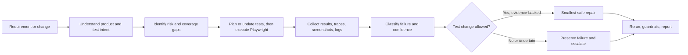

# Turn Codex or Claude Code into a disciplined Playwright QA engineer

[](https://github.com/Mallikarjun-Roddannavar/playwright-agentic-automation/actions/workflows/ci.yml)
[](https://playwright.dev/)
[](https://www.typescriptlang.org/)

> **Turn AI coding agents into evidence-driven Playwright QA engineers.**

`playwright-agentic-automation` gives coding agents—such as Codex and Claude Code—the repository context, QA guardrails, and evidence workflows needed to plan, test, diagnose, repair safely—and know when not to change a failing test. It combines a real Playwright UI/API framework with a repository-local LLM Wiki, focused skills, product/test knowledge, evidence requirements, and deterministic guardrails.

There is no AI platform to deploy: no model keys, SDKs, model router, vector database, hosted service, or mandatory MCP server. Playwright provides browser and test capability. Your coding agent provides intelligence. This repository supplies the QA context and discipline.

## Why this matters

> **When a test fails, an AI should not automatically “fix the test.”**
> First it must determine whether the test is wrong, the application is broken, or the environment is unavailable.

- If a button was renamed, update the locator—but only after evidence confirms the intended control still exists.
- If a Viewer can perform an action they should be forbidden from doing, keep the test failing: it found an application bug.
- If the backend is down, report the environment problem. Do not add arbitrary waits or skip the test.

This repository helps coding agents make that distinction with product context, evidence requirements, policy, and deterministic guardrails. It never auto-classifies a failure or invents evidence.

## Agentic QA workflow



The agent uses requirements and repository knowledge to understand risk, then collects evidence before repairing safely or preserving a failure. The canonical policy is [qa/failure-taxonomy.json](qa/failure-taxonomy.json); see [the QA workflow](docs/QA_WORKFLOW.md) for diagnosis-only and guarded-repair prompts.

## Quick start

```bash
npm install
npm run agent:doctor
npm run qa:demo
npm run test:list
```

For the application-backed suite, install the browser and app dependencies described in [Getting Started](docs/GETTING_STARTED.md), then run `npm test`.

## Core idea: a local LLM Wiki and codebase second brain

This is still a practical Playwright + TypeScript framework: UI Page Objects, API services, role-based browser/API fixtures, application-backed tests, centralized routes/configuration, and deterministic quality checks. Its repository-native AI context gives coding agents durable understanding without a hosted AI platform.

The core building blocks are:

- **LLM Wiki / codebase second brain** — the offline-first [`knowledge/`](knowledge/index.md) bundle contains linked product, test, architecture, decision, and runbook notes.
- **Static evidence graph** — generated AST facts connect imports, routes, fixtures, Page Object navigation, and services. Source hashes make freshness checkable; the graph is not presented as runtime coverage.
- **`AGENTS.md` + focused skills** — repository rules and task-specific workflows route an agent to UI, API, tooling, knowledge, incident analysis, or safe healing work.
- **Portable and model-neutral** — Markdown/OKF, normal repository files, and optional Obsidian navigation; no API key, model SDK, embedding service, or vector database.

Open [`knowledge/`](knowledge/index.md) as an Obsidian vault for backlinks, Graph view, properties, and Mermaid diagrams. Obsidian is optional: the second brain remains plain portable Markdown and does not need an account, plugin, or cloud sync.

Start with the saved knowledge instead of rediscovering the whole repository:

```bash
npm run knowledge:check                 # verify generated facts are current
npm run knowledge:impact -- REQ-RBAC-001 # find candidate QA impact
```

The generated graph is a static map, not a runtime trace, test-coverage percentage, or security proof. Human-reviewed product meaning remains separate from agent proposals.

### Knowledge that grows safely

The second brain is designed to grow with the repository without silently inventing product truth.

```text
Code or configuration changes
  -> generated knowledge becomes stale
  -> npm run knowledge:build refreshes deterministic facts
  -> validation checks freshness and structural integrity

New requirement or QA insight
  -> agent creates an evidence-backed draft
  -> human reviews business meaning and test intent
  -> approved knowledge is promoted into the active bundle
```

This separation is intentional: agents can help discover, organize, and connect evidence, while people retain approval over requirements, expected behavior, and assertion meaning. See [the knowledge-layer workflow](docs/KNOWLEDGE_LAYER.md) for the proposal, review, and promotion commands.

## What ordinary Playwright repositories do not provide

Playwright already offers planner, generator, healer, coding-agent CLI skills, and optional MCP browser tooling. This project intentionally uses or extends those capabilities instead of cloning them.

| Official Playwright                               | This repository                                                                  |
| ------------------------------------------------- | -------------------------------------------------------------------------------- |
| Browser control, test planning/generation/healing | Product/test knowledge and static relationships                                  |
| Agent definitions and optional tool transport     | Failure taxonomy, evidence contract, and repair decision policy                  |
| Executes and can repair tests                     | Guardrails against hidden failures and unsafe repairs                            |
| General-purpose workflows                         | Repository-specific roles, routes, fixtures, requirements, and QA impact context |

## Trust controls

- **Guardrails** block common ways to hide failures: hard waits, skips, forced actions, swallowed catches, raw selectors, and assertion-free specs.
- **Evidence and review** validate machine-readable diagnosis records and explicit human decisions.
- **Coverage and impact** turn requirements and static relationships into explainable QA gaps and candidate affected tests—not fake coverage percentages.
- **Benchmark fixtures** evaluate classification, evidence completeness, safe-healing decisions, and forbidden actions without fabricating agent scores.

Run `npm run qa:demo` for a 10-second deterministic walkthrough: it shows an evidence-based coverage gap, graph-resolved impact from `FoldersService` to five tests, guardrail status, and benchmark-fixture status. It intentionally does not claim that an agent made or repaired a decision.

For real Playwright artifacts from a controlled locator-drift fault, run `npm run qa:runtime-demo`; then validate `qa-results/runtime/result.json`. Results stay local in ignored `qa-results/`. See [the same-Codex comparison protocol](docs/QA_COMPARISON_PROTOCOL.md) before publishing any guided-versus-baseline claim.

## Copy/paste prompts

```text
Analyze the latest Playwright failures. Do not modify files. For every failure,
provide classification, confidence, evidence, root-cause hypothesis, and whether
test modification is permitted. Use qa/failure-taxonomy.json; UNKNOWN is valid.
```

```text
Fix only HIGH-confidence LOCATOR_DRIFT. Preserve assertions. Do not skip, fixme,
delete, swallow errors, force actions, or change product expectations. Run
npm run qa:guardrails and rerun each repaired test.
```

```text
Review this change for QA impact. Identify affected behavior, roles, routes,
tests, and the highest-risk missing regression scenario. Start with knowledge.
```

These prompts work with Codex or Claude Code; neither requires a separate repository architecture. If desired, configure official Playwright CLI skills or MCP using the current [Playwright coding-agent documentation](https://playwright.dev/docs/getting-started-cli).

## Learn more

- [AGENTS.md](AGENTS.md): repository operating rules.
- [.agents/skills](.agents/skills/README.md): focused agent workflows.
- [qa](qa/README.md): canonical failure policy and evidence contract.
- [qa-evals](qa-evals): ground-truth evaluation fixtures.
- [ROADMAP.md](ROADMAP.md): outcome-based next work.
- [CONTRIBUTING.md](CONTRIBUTING.md): contribution guidance.
