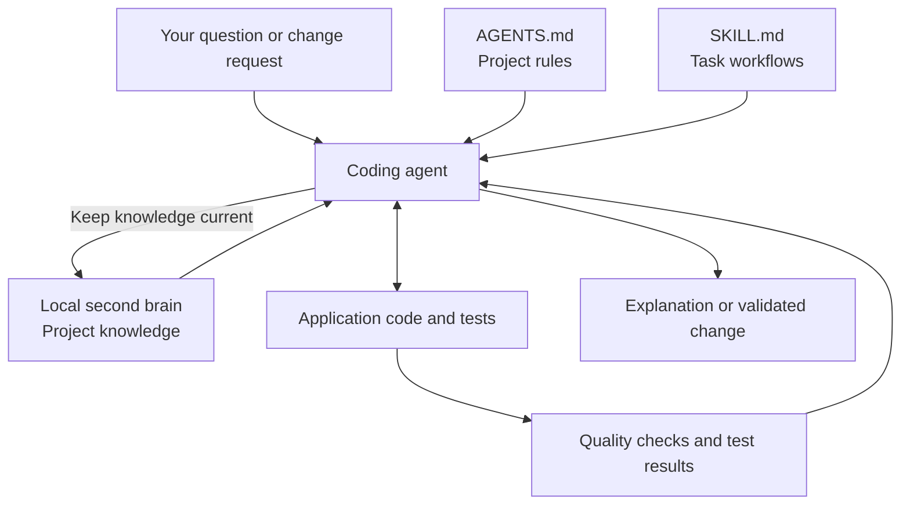

# A local codebase second brain for coding agents

[](https://github.com/Mallikarjun-Roddannavar/playwright-agentic-automation/actions/workflows/ci.yml)
[](https://playwright.dev/)
[](https://www.typescriptlang.org/)

> **Give your coding agent project knowledge, clear rules, and focused task instructions, all inside the repository.**

`playwright-agentic-automation` shows how three simple building blocks work together: a **local codebase second brain**, **`AGENTS.md` project rules**, and **`SKILL.md` task workflows**. You can read them yourself, ask your agent about a feature, and update the documentation alongside the code.

A working Playwright + TypeScript framework makes the ideas concrete. Its React/FastAPI application, UI/API tests, role fixtures, and QA checks provide real source files and assertions for the agent to inspect.

## Three files, three clear jobs

| Building block                                 | Question it answers                              | Example in this project                                                               |
| ---------------------------------------------- | ------------------------------------------------ | ------------------------------------------------------------------------------------- |
| [Local second brain](knowledge/README.md)      | What does this project do, and how is it tested? | Authentication uses `/token`; the note links the flow, assertions, and coverage gaps. |
| [AGENTS.md](AGENTS.md)                         | What rules must the agent follow here?           | Keep selectors in Page Objects and assertions in tests.                               |
| [SKILL.md workflows](.agents/skills/README.md) | How should the agent perform this task?          | Read a feature note, inspect its linked source, and explain the evidence.             |

Knowledge saves explanations. Rules set project conventions. Skills provide a repeatable way to do the work. Each has a distinct purpose, so the same guidance does not need to be copied into every file.

## The local codebase second brain

Saved project knowledge helps your agent explain how a feature works, find relevant code and tests, and understand past decisions. It gives each new task a useful starting point and stays with your project as it evolves.

Ask naturally: **"How does login work?"**, **"What tests cover folders?"**, or **"What should we check before changing this feature?"**

## AGENTS.md: the project rules

[AGENTS.md](AGENTS.md) tells the agent how to work in this repository. It identifies the right skill and defines conventions for Page Objects, services, configuration, fixtures, naming, and validation.

Examples include:

- Keep selectors and actions in Page Objects; keep assertions in specs.
- Return raw API responses from services so tests express their own expectations.
- Use centralized routes, configuration, waits, and scoped logging.
- Preserve test intent and diagnose failures before changing tests.

Nested application `AGENTS.md` files add frontend/backend guidance. Rules stay close to the code they govern.

## SKILL.md: a workflow for the task

Five focused skills live under `.agents/skills/`. Each has a `SKILL.md` describing when to use it, what to inspect, how to make a change, and how to validate the result.

| Skill                                                                  | Task                                                               |
| ---------------------------------------------------------------------- | ------------------------------------------------------------------ |
| [codebase-second-brain](.agents/skills/codebase-second-brain/SKILL.md) | Explain features, architecture, coverage, and maintain notes.      |
| [pw-ui-pom](.agents/skills/pw-ui-pom/SKILL.md)                         | Update UI Page Objects, selectors, navigation, and specs.          |
| [pw-api-pom](.agents/skills/pw-api-pom/SKILL.md)                       | Update API services, specs, fixtures, and authentication sessions. |
| [pw-framework-tooling](.agents/skills/pw-framework-tooling/SKILL.md)   | Maintain configuration, reporting, logging, and quality tooling.   |
| [qa-safe-healing](.agents/skills/qa-safe-healing/SKILL.md)             | Investigate failures and apply evidence-backed, permitted repairs. |

The knowledge skill follows a short workflow: find the note, inspect linked source, explain the evidence, and update the affected note when behavior changes. Skills guide the coding agent; they are not background services.

## See the three parts work together

Ask your agent naturally:

> Explain how login works and what its tests actually check. Show source links and missing coverage.


```mermaid
flowchart TB
    User[Your question or change request] --> Agent[Coding agent]
    Rules["AGENTS.md<br/>Project rules"] --> Agent
    Skills["SKILL.md<br/>Task workflows"] --> Agent
    Knowledge["Local second brain<br/>Project knowledge"] --> Agent
    Agent <--> Code[Application code and tests]
    Code --> Checks[Quality checks and test results]
    Checks --> Agent
    Agent --> Outcome[Explanation or validated change]
    Agent -->|Keep knowledge current| Knowledge
```

The agent follows the repository rules, uses the knowledge skill, reads the authentication note, and checks its source links. Its answer should distinguish requirements, implementation, test assertions, and any tests it actually ran.

For a change review, ask:

> Review this folder change. Which roles, source files, tests, and missing scenarios should I check?

For implementation, ask:

> Update this feature, follow the relevant UI or API skill, validate the change, and update its feature note with the source links and coverage gaps.

You do not need to name a knowledge file or run a knowledge command to ask these questions.

## Keep the second brain simple

When behavior changes, update the affected note in the same change. Update architecture when shared structure changes and decisions when a meaningful design choice changes. Preserve requirement IDs and unanswered questions.

Keep raw requirements in [requirements/incoming](requirements/incoming/README.md). Put new business interpretations in a clearly marked **Pending review** section for human confirmation before treating them as requirements. Ordinary source-backed documentation updates need no promotion process.

The notes are plain Markdown with links. There is no knowledge build step, generated graph, database, or automatic freshness check. When a note and source disagree, identify the mismatch and correct the explanation using evidence.

## The working Playwright example

The framework includes UI Page Objects, API services, admin/editor/viewer browser and API fixtures, registered cleanup, centralized routes/configuration, scoped logging, waits, and reporting. Existing [manual scenarios](app/manual_test_cases/README.md) preserve additional boundary, authorization, and error checks.

```bash
npm install
npm run agent:doctor
npm run quality:check
npm run test:list
```

Follow [Getting Started](docs/GETTING_STARTED.md) to install browser and application dependencies. Run `npm test` for the application-backed suite, `npm run test:ui` or `npm run test:api` for a project, and `npm run report` to open its report.

Your coding agent uses local repository files. No model keys, model SDK, hosted knowledge service, or mandatory MCP server are required by this project.

## Quality stays part of the workflow

`npm run quality:check` runs naming checks, ESLint, TypeScript, Prettier, and QA guardrails. Guardrails detect common ways to hide failures, including skipped tests, forced actions, swallowed errors, and assertion-free specs.

When a test fails, preserve its evidence and follow [the QA workflow](docs/QA_WORKFLOW.md) and [safe-diagnosis skill](.agents/skills/qa-safe-healing/SKILL.md). A renamed locator may permit a focused repair; a forbidden action succeeding is an application defect. Missing dependencies are an environment problem.

Try this diagnosis prompt:

```text
Analyze the latest Playwright failures. Do not modify files. For every failure,
provide classification, confidence, evidence, a supported cause or hypothesis,
and whether test modification is permitted. Use the failure policy in .agents/skills/qa-safe-healing/SKILL.md;
UNKNOWN is valid. Separate source inspection from actual test execution.
```

Keep original evidence and a short Markdown diagnosis under ignored `qa-results/<run>/`. Record the cause or hypothesis, evidence, missing information, and any required human approval alongside the repair decision.

## Start exploring

1. Open [project knowledge](knowledge/README.md) and choose a feature.
2. Read [AGENTS.md](AGENTS.md) to understand the project rules.
3. Read its [task skill](.agents/skills/README.md) to see how the agent works.
4. Follow source links and ask the agent to explain the feature or review a change.

See [Getting Started](docs/GETTING_STARTED.md), [QA Workflow](docs/QA_WORKFLOW.md), and the [practice application](app/README.md) for setup and validation details.
