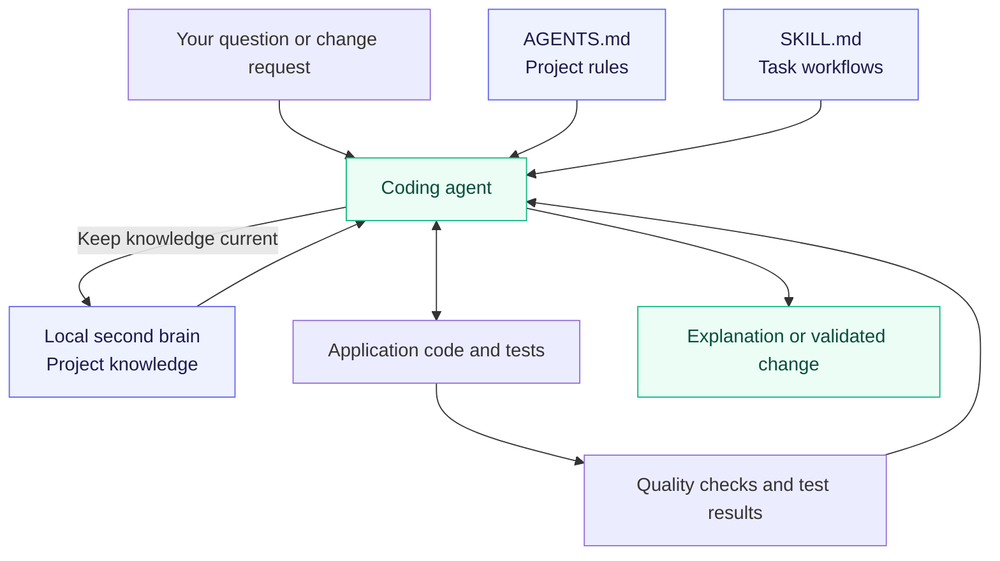

# Turn agents into a disciplined Playwright QA engineer

> **Understand the project. Follow its rules. Make changes with evidence.**

[](https://github.com/Mallikarjun-Roddannavar/playwright-agentic-automation/actions/workflows/ci.yml)
[](https://playwright.dev/)
[](https://www.typescriptlang.org/)

**[Try it](#try-it-with-one-question) | [How it works](#agentic-qa-workflow) | [Run the tests](#run-the-playwright-example) | [Adopt the pattern](#adopt-the-pattern-in-your-project)**

`playwright-agentic-automation` turns AI coding agents, such as Codex and Claude Code, into evidence-driven Playwright QA engineers. It gives them a **local codebase second brain**, **project rules in `AGENTS.md`**, and **focused workflows in `SKILL.md`** to understand features, plan tests, diagnose failures, and repair safely.

A real Playwright UI/API framework puts the pattern into practice. Playwright provides browser and test capability. Your coding agent provides intelligence. This repository supplies the context and QA discipline.

**Local Markdown. No AI platform to deploy.** No model keys, SDKs, model router, vector database, hosted service, or mandatory MCP server are required by this project.

## Try it with one question

Open this repository in your coding agent and ask:

```text
Explain how login works and what its tests actually check.
Show source links and missing coverage. Do not change files.
```

The agent starts with saved project knowledge, follows the source links, and explains the behavior and assertions. You can try this before installing the app or running tests.

**What you should get:** a clear feature explanation, relevant code and tests, and honest coverage gaps. Reading source and executing tests are reported separately.

## Three building blocks, easy to adopt

| Building block                                | Gives your agent                                                    | Helps you                                                          |
| --------------------------------------------- | ------------------------------------------------------------------- | ------------------------------------------------------------------ |
| **[Local second brain](knowledge/README.md)** | Saved explanations of features, architecture, tests, and decisions. | Understand a feature without starting from scratch.                |
| **[AGENTS.md](AGENTS.md)**                    | Project conventions and boundaries.                                 | Keep changes consistent with the way your project works.           |
| **[SKILL.md](.agents/skills/README.md)**      | A focused workflow for a particular task.                           | Repeat useful investigation, implementation, and validation steps. |

**Knowledge explains the project. Rules guide the work. Skills guide the task.**

The second brain stays small and readable. Ask "How does login work?", "What tests cover folders?", or "What should we check before changing this feature?" No knowledge commands are needed.

## Why this matters

> **When a test fails, an AI should not automatically "fix the test."**
> First it must determine whether the test is wrong, the application is broken, or the environment is unavailable.

| What happened?                           | What should the agent do?                                                        |
| ---------------------------------------- | -------------------------------------------------------------------------------- |
| A button was renamed.                    | Confirm the intended control still exists, then make a permitted locator repair. |
| A Viewer can perform a forbidden action. | Preserve the failing assertion: it found an application bug.                     |
| The backend is down.                     | Report the environment problem. Do not add arbitrary waits or skip tests.        |

Product context, evidence requirements, and guardrails help the agent make that distinction. The repository does not auto-classify failures or invent evidence.

## Agentic QA workflow

The agent combines rules, skills, and knowledge, checks the actual source, and validates its work. On failure, it preserves evidence and diagnoses the cause before deciding whether a repair is permitted.


```mermaid
flowchart TB
    User[Your question or change request] --> Agent[Coding agent]
    Rules["AGENTS.md<br/>Project rules"] --> Agent
    Skills["SKILL.md<br/>Task workflows"] --> Agent
    Knowledge["Local second brain<br/>Project knowledge"] --> Agent
    Agent <--> Code[Application code and tests]
    Code --> Checks[Quality checks and test results]
    Checks --> Agent
    Agent --> Outcome[Explanation or validated change]
    Agent -->|Keep knowledge current| Knowledge
    classDef context fill:#eef2ff,stroke:#6366f1,color:#1e1b4b
    classDef action fill:#ecfdf5,stroke:#10b981,color:#064e3b
    class Rules,Skills,Knowledge context
    class Agent,Outcome action
```

## Pick a task, use a focused skill

| Task                                                            | Skill                                                                  |
| --------------------------------------------------------------- | ---------------------------------------------------------------------- |
| Understand a feature or its test coverage.                      | [codebase-second-brain](.agents/skills/codebase-second-brain/SKILL.md) |
| Update UI Page Objects, selectors, navigation, or specs.        | [pw-ui-pom](.agents/skills/pw-ui-pom/SKILL.md)                         |
| Update API services, specs, fixtures, or auth sessions.         | [pw-api-pom](.agents/skills/pw-api-pom/SKILL.md)                       |
| Maintain configuration, logging, reporting, or quality tooling. | [pw-framework-tooling](.agents/skills/pw-framework-tooling/SKILL.md)   |
| Investigate failures and make permitted repairs.                | [qa-safe-healing](.agents/skills/qa-safe-healing/SKILL.md)             |

You can ask naturally; [project rules](AGENTS.md) route the task to the relevant skill. Skills guide the agent's work and validation.

## Ask, review, then change

**Understand a feature**

> Explain how login works. Separate requirements, implementation, test assertions, and missing coverage.

**Review a change**

> Review this folder change. Which roles, source files, tests, and missing scenarios should I check?

**Implement with care**

> Update this feature, follow the relevant UI or API skill, validate the change, and update its feature note.

**Diagnose a failure**

> Analyze the latest Playwright failures without changing files. Report classification, confidence, evidence, a supported cause or hypothesis, and whether test modification is permitted.

## Run the Playwright example

The sample React/FastAPI application includes UI/API tests, admin/editor/viewer sessions, cleanup, Page Objects, API services, logging, and reporting. [Manual scenarios](app/manual_test_cases/README.md) add boundary, authorization, and error checks.

From the repository root:

```bash
npm install
npm run quality:check
npm run test:list
```

Follow **[Getting Started](docs/GETTING_STARTED.md)** to install browser and application dependencies. `npm run agent:doctor` checks runtime readiness.

| Command                 | Use it for                                                |
| ----------------------- | --------------------------------------------------------- |
| `npm test`              | Run the application-backed suite.                         |
| `npm run test:ui`       | Run UI tests.                                             |
| `npm run test:api`      | Run API tests.                                            |
| `npm run report`        | Open the Playwright report.                               |
| `npm run quality:check` | Run naming, guardrails, ESLint, TypeScript, and Prettier. |

For failures, follow [QA Workflow](docs/QA_WORKFLOW.md) and the [safe-diagnosis policy](.agents/skills/qa-safe-healing/SKILL.md). Keep original evidence and a short Markdown diagnosis under ignored `qa-results/<run>/`; record any required human approval. Preserve assertions and rerun affected tests after permitted repairs.

## Adopt the pattern in your project

Start small:

1. **Write your rules.** Use `AGENTS.md` for the conventions and checks your project actually needs.
2. **Document one feature.** Save its purpose, flow, source links, tests, and open questions in a Markdown note.
3. **Add one useful skill.** Write a `SKILL.md` for a task you repeat. Adapt paths, commands, and conventions to your repository.
4. **Keep notes with the change.** Update the affected explanation when behavior changes.

Use this repository as a working example. Expand the notes and skills as useful tasks emerge.

Keep intended business behavior separate from observed implementation. New business interpretations need human confirmation in a **Pending review** section; ordinary source-backed documentation updates need no promotion process. Preserve requirement IDs and unresolved questions. Raw requirements stay in [requirements/incoming](requirements/incoming/README.md).

Notes are plain Markdown with links. They have no automatic freshness check, so confirm important claims against source and explain any mismatch.

---

**Explore:** [Project knowledge](knowledge/README.md) | [Project rules](AGENTS.md) | [Agent skills](.agents/skills/README.md) | [Getting Started](docs/GETTING_STARTED.md) | [QA Workflow](docs/QA_WORKFLOW.md)
