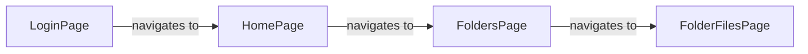

# Scope

Page-object construction edges inferred from concrete TypeScript new expressions. It is a static code graph, not a runtime call graph.

# Mermaid diagram

# Machine-readable graph

Use [code-graph.json](../code-graph.json) for complete nodes, typed edges, evidence locations, and source hashes.
